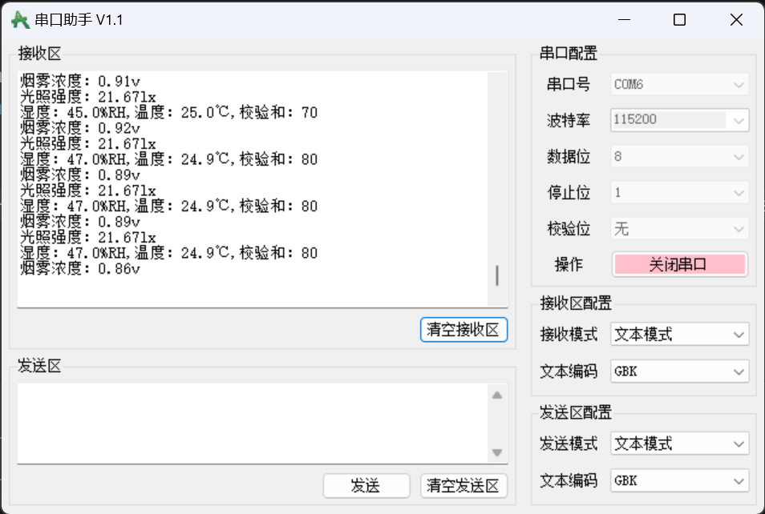

# EvnMonitor — 基于 STM32 + FreeRTOS 的智能环境监测终端

基于 **STM32F103C8T6** + **FreeRTOS** 的多传感器环境监测系统，实现温度、湿度、烟雾浓度、光照强度的实时检测与显示，支持用户自定义报警阈值，超限时自动触发声光报警及舵机模拟应急措施。

效果视频：https://www.bilibili.com/video/BV1b9J36eEhe/





## 项目概览

系统通过 DHT11（温湿度）、MQ2（烟雾）、BH1750（光照）三种传感器采集环境数据，OLED 屏幕实时显示监测结果与状态等级。当任意两个及以上传感器超过用户设定的报警线时，自动触发 LED 闪烁、蜂鸣器鸣响、360° 舵机旋转（模拟开窗通风）等应急响应。用户可通过按键在 OLED 上浏览数据、修改各传感器报警阈值。

## 硬件平台

| 模块 | 型号 / 说明 | 引脚 |
|------|------------|------|
| 主控芯片 | STM32F103C8T6（LQFP48，72MHz） | — |
| 温湿度传感器 | DHT11（单总线协议） | PA8 |
| 烟雾传感器 | MQ2（模拟量输出） | PA6（ADC1_CH6） |
| 光照传感器 | BH1750（软件 I2C） | PB6(SCL) / PB7(SDA) |
| 显示屏 | 0.96" OLED（I2C 接口） | PB6(SCL) / PB7(SDA) |
| 舵机 | 360° MG90S（连续旋转） | PA3（TIM2_CH3 PWM） |
| LED 指示灯 | — | PA0 |
| 有源蜂鸣器 | — | PA1 |
| 按键 × 3 | 上翻 / 下翻 / 确认 | PB11 / PB10 / PB1 |
| 串口 | USART1（115200bps，上位机通信） | PA9(TX) / PA10(RX) |

## 软件架构

```
EvnMonitor/
├── code/                       # STM32 工程代码
│   ├── Core/                   # HAL 库生成代码 + FreeRTOS 配置
│   │   ├── Inc/
│   │   │   ├── main.h          # 全局头文件
│   │   │   ├── FreeRTOSConfig.h # FreeRTOS 内核配置
│   │   │   ├── adc.h           # ADC 外设声明
│   │   │   ├── i2c.h           # I2C 外设声明
│   │   │   ├── tim.h           # 定时器声明
│   │   │   └── usart.h         # 串口声明
│   │   └── Src/
│   │       ├── main.c          # 系统初始化、外设启动、内核启动
│   │       ├── freertos.c      # FreeRTOS 任务创建、互斥量、事件组
│   │       ├── adc.c           # ADC1 初始化与数据采集（MQ2 用）
│   │       ├── tim.c           # TIM2/TIM3 初始化（PWM 输出）
│   │       ├── usart.c         # USART1 初始化 + uart_printf_rtos()
│   │       ├── gpio.c          # GPIO 引脚初始化
│   │       └── i2c.c           # I2C1 外设初始化
│   ├── Drivers/                # STM32 HAL 驱动库
│   │   ├── CMSIS/
│   │   └── STM32F1xx_HAL_Driver/
│   ├── Middlewares/             # FreeRTOS 中间件
│   ├── User/                   # 用户驱动层（各传感器与外设）
│   │   ├── DHT11.c/h           # DHT11 温湿度传感器驱动
│   │   ├── MQ2.c/h             # MQ2 烟雾传感器驱动（ADC）
│   │   ├── BH1750.c/h          # BH1750 光照传感器驱动（软件 I2C）
│   │   ├── OLED.c/h            # 0.96" OLED 显示驱动（软件 I2C）
│   │   ├── OLED_Data.c/h       # OLED 字模数据（ASCII + 中文 + 图标）
│   │   ├── Servo.c/h           # 360° 舵机控制（TIM2 PWM）
│   │   ├── Buzzer.c/h          # 有源蜂鸣器控制
│   │   ├── LED.c/h             # LED 指示灯控制
│   │   ├── Key.c/h             # 三键输入（含消抖）
│   │   └── Delay_us.c/h        # 微秒级延时（DHT11 时序用）
│   ├── MDK-ARM/                # Keil 工程文件
│   └── code.ioc                # STM32CubeMX 工程配置
├── images/                     # 项目图片
├── EvnMonitor.xlsx             # 引脚分配 / 模块接线表
├── LICENSE                     # MIT License
└── README.md
```

## FreeRTOS 任务调度

| 任务 | 优先级 | 栈大小 | 功能 |
|------|--------|--------|------|
| DHT11Task | osPriorityNormal2 | 256×2 B | DHT11 温湿度采集，1s 周期 |
| MQ2Task | osPriorityNormal2 | 512×2 B | MQ2 烟雾浓度采集（ADC），1s 周期 |
| BH1750Task | osPriorityNormal2 | 512×2 B | BH1750 光照强度采集，1s 周期 |
| OLED_FlashTask | osPriorityNormal | 512×2 B | OLED 界面刷新、按键交互、报警线设置 |
| AlertTask | osPriorityNormal | 256×2 B | 综合判断报警条件，触发声光 + 舵机 |
| defaultTask | osPriorityNormal | 256×2 B | 栈水位监测（调试用） |

### 同步机制

- **事件组 `KeyFinishedEventGroup`**：按键处理期间清除标志位，阻塞传感器任务，避免按键设置界面被传感器数据更新打断
- **互斥量 `Mutex1`**：保护 DHT11 / MQ2 / BH1750 对 I2C 总线和 UART 的互斥访问

## 传感器数据等级划分

### MQ2 烟雾浓度（电压值）

| 电压范围 | 等级 | 说明 |
|----------|------|------|
| 0.5V ~ 1.0V | 纯净 | 气敏电阻最大，环境非常干净 |
| 1.0V ~ 2.0V | 正常 | 日常室内轻微杂味，无泄漏 |
| 2.0V ~ 3.0V | 轻微 | 开始有气体，可设为预警线 |
| 3.0V ~ 4.0V | 明显 | 泄漏明显，报警 |
| 4.0V ~ 5.0V | 危险 | 高浓度燃气 / 浓烟 |

### BH1750 光照强度（lux）

| 光照范围 | 等级 | 说明 |
|----------|------|------|
| < 10 lx | 极暗 | 黑夜 / 月夜 |
| 10 ~ 50 lx | 暗 | 室内弱光 / 傍晚 |
| 50 ~ 500 lx | 中等 | 室内正常照明 |
| 500 ~ 5000 lx | 亮 | 窗边 / 室外阴天 |
| ≥ 5000 lx | 极亮 | 晴天直射 |

### DHT11 温湿度

- 温度精度：±2°C，湿度精度：±5%RH
- 默认报警线：湿度 70%，温度 35°C（可通过按键修改）

## 报警逻辑

当 **任意两个及以上** 传感器超过用户设定的报警线时，系统自动触发：

1. **LED** 闪烁（PA0）
2. **蜂鸣器** 间歇鸣响（PA1）
3. **360° 舵机** 顺时针旋转（PA3，模拟开窗通风）

当报警条件解除后，舵机停止，LED 和蜂鸣器关闭。

## 按键交互

| 按键 | 引脚 | 功能 |
|------|------|------|
| 上翻 | PB11 | 数值 +1 / 选项上移 |
| 下翻 | PB10 | 数值 -1 / 选项下移 |
| 确认 | PB1 | 进入子菜单 / 保存返回 |

支持对每个传感器的报警阈值进行独立修改：
- **DHT11**：分别设置湿度和温度的报警值（4 个可调位）
- **MQ2**：设置烟雾浓度报警电压（整数位 + 小数位）
- **BH1750**：设置光照强度报警阈值（4 位数字）

## 串口输出

通过自定义 `uart_printf_rtos()` 函数（基于 `vsnprintf` + `HAL_UART_Transmit`），在 FreeRTOS 环境下安全地向 USART1（115200bps）输出格式化调试信息：

```
湿度：65.00%RH, 温度：28.50℃, 校验：OK
烟雾浓度：1.85v
光照强度：320.50lx
```

## 开发环境

- **IDE**: Keil MDK-ARM V5.32
- **配置工具**: STM32CubeMX 6.10.0
- **固件库**: STM32Cube FW_F1 V1.8.7
- **RTOS**: FreeRTOS (CMSIS_V2)
- **时钟配置**: HSE 8MHz → PLL ×9 → SYSCLK 72MHz

## 编译与烧录

1. 使用 STM32CubeMX 打开 `code/code.ioc`（如需修改引脚或外设配置）
2. 使用 Keil MDK 打开 `code/MDK-ARM/code.uvprojx`
3. 编译工程
4. 通过 ST-Link 烧录至 STM32F103C8T6

## 许可证

[MIT License](LICENSE)

## 开发日志

2026
  5.26
    完成oled初始化
  5.29
    从PCtoLCD2002取模软件中取模所需中文字符字模并添加到OLED_Data.c的中文字模数组const ChineseCell_t OLED_CF16x16[]中
  5.31-1
    1.完成初始界面
    2.创建任务DHT11Task且对应模块通信成功，并稳定输出温湿度信息
  6.1
    添加按键功能;创建事件组KeyFinishedEventGroup以避免高优先级的多个任务抢占使用权
  6.3
    1.开启ADC功能供mq2烟雾传感器使用,并配置pa6为模拟量的输入引脚,使用软件触发adc
    2.编写mq2数据输出界面，根据由模拟量转换出来的电压值划分如下等级
        0.5V ~ 1.0V	纯净空气、无燃气、无烟雾	气敏电阻 最大，导电最弱，环境非常干净
        1.0V ~ 2.0V	正常室内空气	日常室内轻微杂味，无泄漏
        2.0V ~ 3.0V	轻微烟雾 / 微量燃气	开始有气体，可设为预警线
        3.0V ~ 4.0V	明显燃气 / 烟雾	泄漏明显，报警
        4.0V ~ 5.0V	高浓度燃气 / 浓烟	危险浓度，严重泄漏
    3. 配置引脚pb6和pb7分别为光强度传感器BH1750的SCL和SDA引脚,以实现软件i2c控制BH1750和获取光照强度,按光照强度划分如下等级:
            极暗（黑夜 / 月夜）
            BH1750_LightIntensity < 10
            暗（室内弱光 / 傍晚）
            10 ≤ BH1750_LightIntensity < 50
            中等（室内正常照明）
            50 ≤ BH1750_LightIntensity < 500
            亮（窗边 / 室外阴天）
            500 ≤ BH1750_LightIntensity < 5000
            极亮（晴天直射）
            BH1750_LightIntensity ≥ 5000
    4.创建任务MQ2Task和BH1750Task,并给所有模块的任务暂时都分配512*4字节的栈,优先级为osPriorityNormal2
    5.创建互斥量Mutex1,让各传感器的通信相互独立
    6.完成MQ2和BH1750模块数据显示
  6.6
    1.减少单个任务运行间隔,提高实时性
    2.优化数据显示界面
    3.实现警告线设置功能
    4.配置tim2的通道三为pwm波输出,用于360°舵机运转
    5.初始化蜂鸣器和led用作报警系统
    6.初始化360°舵机,模拟触发报警时打开窗户的一种应对措施
  6.8
    1.将报警功能独立出来,创建任务AlertTask,解决在修改报警线数值的界面中的bug
    2.使用freertos栈溢出和栈监测功能合理地对OLEDTask等任务进行栈分配和对freertos堆的分配
    3.修复DHT11修改第四个报警值时的显示问题
  6.10
    1.修复dht11模块DHT11_Check()函数的校验问题
    2.删除了一些测试时使用的变量
  6.11
    根据逻辑分析仪，对DHT11的波形进行分析，调整高低电平的判断条件，进一步稳定mcu与DHT11间的通信
  6.14
    修复舵机运行卡顿的现象
  6.15
    自定义函数void uart_printf_rtos(const char *fmt, ...)调用HAL_UART_Transmit发送信息给上位机
